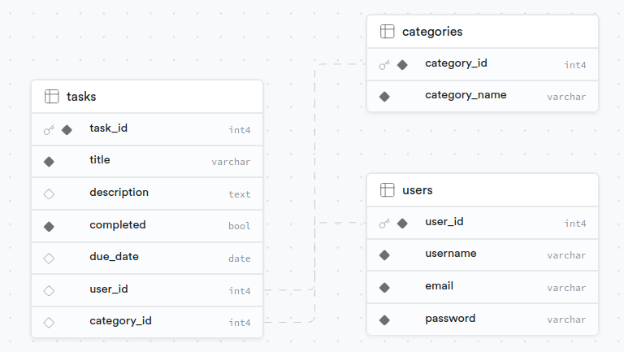

# Task Management API with Flask, FastAPI, and PostgreSQL (Supabase)

## Introduction

This project involves the development of a robust API for managing a task list, using Flask API and FastAPI as server-side frameworks, and Supabase as the PostgreSQL database. The API facilitates the creation, updating, deletion, and retrieval of tasks, as well as categorization and association with users.

## Database Modeling

### Table "Users"

- `user_id` (Primary Key)
- `username`
- `email`
- `password` (hashed)

Stores user information, where each user has a unique identifier (`user_id`).

### Table "Tasks"

- `task_id` (Primary Key)
- `title`
- `description`
- `completed` (Boolean)
- `due_date`
- `user_id` (Foreign Key linked to the "Users" table)

Contains details of tasks, where each task has a unique identifier (`task_id`) and is associated with a user through the foreign key `user_id`.

### Table "Categories"

- `category_id` (Primary Key)
- `name`

Allows categorization of tasks. Each category has a unique identifier (`category_id`) and can be associated with multiple tasks.

## Schema Visualizer

## Usage

1. Clone the repository.

2. Install dependencies using `pip install -r requirements.txt`.

3. Run the API with Flask: `python mainFlask.py` or with FastAPI: `python mainFast.py`.

4. Access the API at: [http://localhost:5000](http://localhost:5000) for Flask or [http://127.0.0.1:3000/docs](http://127.0.0.1:3000/docs) for FastAPI.

## Endpoints

- **Get the list of tasks:**
  - **Method:** GET
  - **Endpoint:** `/api/tasksmanager/tasks/`

- **Create a new task:**
  - **Method:** POST
  - **Endpoint:** `/api/tasksmanager/tasks/`

- **Update an existing task:**
  - **Method:** PUT
  - **Endpoint:** `/api/tasksmanager/tasks/<task_id>`

- **Delete a task:**
  - **Method:** DELETE
  - **Endpoint:** `/api/tasksmanager/tasks/<task_id>`

- **Get Task by ID:**
  - **Method:** GET
  - **Endpoint:** `/api/tasksmanager/tasks/<task_id>`

- **Filter Tasks by Status:**
  - **Method:** GET
  - **Endpoint:** `/api/tasksmanager/tasks?status=<completed|not_completed>`

- **Filter Tasks by Due Date Range:**
  - **Method:** GET
  - **Endpoint:** `/api/tasksmanager/tasks?start_date=<start_date>&end_date=<end_date>`

- **Assign Task to User:**
  - **Method:** POST
  - **Endpoint:** `/api/tasksmanager/tasks/<task_id>/assign/<user_id>`

- **List Tasks for a User:**
  - **Method:** GET
  - **Endpoint:** `/api/tasksmanager/users/<user_id>/tasks`

- **Mark Task as Completed:**
  - **Method:** PUT
  - **Endpoint:** `/api/tasksmanager/tasks/<task_id>/complete`

- **Undo Task Completion:**
  - **Method:** PUT
  - **Endpoint:** `/api/tasksmanager/tasks/<task_id>/undo_complete`

- **List Task Categories:**
  - **Method:** GET
  - **Endpoint:** `/api/tasksmanager/categories`

- **Create New Task Category:**
  - **Method:** POST
  - **Endpoint:** `/api/tasksmanager/categories`

- **Update Task Category:**
  - **Method:** PUT
  - **Endpoint:** `/api/tasksmanager/categories/<category_id>`

- **Delete Task Category:**
  - **Method:** DELETE
  - **Endpoint:** `/api/tasksmanager/categories/<category_id>`

## Main Features for FastAPI

FastAPI automatically generates documentation accessible at: [http://127.0.0.1:3000/docs](http://127.0.0.1:3000/docs).

## Configuration

The API uses Flask and/or Fast for route management. Request logs are saved in a `logs.json` file for Flask. The privacy policy is displayed at the root of the API.

## Author

[GBE Keagnon Grâce Helena](mailto:keagnon.gbe@gmail.com)

## Documentation Sphinx ReadTheDocs

The complete documentation is available in the following path: `/docs/_build/index.html`.
